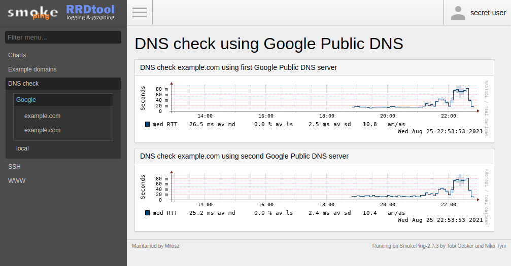

```
# --------------------------------------------------------------------------
# 0xCyberLiTech
# Date de création : le 21-06-2023
# Date de modification : le 23-06-2023
# Sujet : SMOKEPING
# --------------------------------------------------------------------------
```
## A la découverte de SMOKEPING.



#### Présentation :

Surveiller sa latence réseau avec SmokePing

La bande passante n'est pas la seule caractéristique à prendre en compte dans la performance de vos réseau. En effet, certaines applications comme la voie sur IP ou les jeux en ligne sont très sensible à la latence et à sa variation. De nombreux outils permette de faire la supervision de ces mesures (on peut citer notamment Cacti). Nous allons dans cet article parler de SmokePing, un outil libre, modulaire et léger permettant de mesurer et grapher un grand nombre de paramètres de votre réseau.

Installer et configurer SmokePing.

Mettre à jour l'index des packages.
```
apt-get update
```
Installez le package smokeping, mais ignorez les packages recommandés.
```
apt install --no-install-recommends smokeping dnsutils curl
```
Dans un premier temps, vérifiez les paramètres de la base de données car vous ne pourrez pas les modifier facilement par la suite. 
J'utiliserai les paramètres par défaut, ce qui signifie 20 pings toutes les 5 minutes.

Nous retrouverons nos fichiers de configuration vers :
```
/etc/smokeping/config.d/
                 ├───> Alerts
                 ├───> Database
                 ├───> General
                 ├───> pathnames
                 ├───> Presentation
                 ├───> Probes
                 ├───> Slaves
                 └───> Targets
```
Les fichiers de configuration pris en charge sont déclarés dans le fichier /etc/smokeping/config.
```
cat /etc/smokeping/config

@include /etc/smokeping/config.d/General
@include /etc/smokeping/config.d/Alerts
@include /etc/smokeping/config.d/Database
@include /etc/smokeping/config.d/Presentation
@include /etc/smokeping/config.d/Probes
@include /etc/smokeping/config.d/Slaves
@include /etc/smokeping/config.d/Targets
```
#### Fichier de configuration (Database).
#### /etc/smokeping/config.d/Database
```
cat /etc/smokeping/config.d/Database

*** Database ***

step     = 300
pings    = 20

# consfn mrhb steps total

AVERAGE  0.5   1  1008
AVERAGE  0.5  12  4320
    MIN  0.5  12  4320
    MAX  0.5  12  4320
AVERAGE  0.5 144   720
    MAX  0.5 144   720
    MIN  0.5 144   720
```
#### Fichier de configuration (General).
#### /etc/smokeping/config.d/General
```
cat /etc/smokeping/config.d/General

*** General ***

owner    = CyberLiTech
contact  = some@address.nowhere
mailhost = my.mail.host
# NOTE: do not put the Image Cache below cgi-bin
# since all files under cgi-bin will be executed ... this is not
# good for images.
cgiurl = http://some.url/smokeping.cgi
# specify this to get syslog logging
syslogfacility = local0
# each probe is now run in its own process
# disable this to revert to the old behaviour
# concurrentprobes = no

@include /etc/smokeping/config.d/pathnames
```
Mettez à jour l'adresse cgiurl. 
(cgiurl = http://some.url/smokeping.cgi) par (cgiurl = http://192.168.0.200/smokeping.cgi).

#### Fichier de configuration (Probes).
#### /etc/smokeping/config.d/Probes
```
cat /etc/smokeping/config.d/Probes

*** Probes ***

+ FPing

binary = /usr/bin/fping

+ DNS
binary = /usr/bin/dig
lookup = domain-to-lookup.com
pings = 5
step = 180

+ Curl
# probe-specific variables
binary = /usr/bin/curl
step = 60

# a default for this target-specific variable
urlformat = http://%host%/
```
#### Fichier de configuration (Targets).
#### /etc/smokeping/config.d/Targets
```
cat /etc/smokeping/config.d/Database

*** Targets ***

probe = FPing

menu = Top
title = Network Latency Grapher
remark = Welcome to the SmokePing website of xxx Company. \
         Here you will learn all about the latency of our network.

+ home

menu = home
title = home
#parents = owner:/Test/James location:/

++ srv-linux-01

menu = srv-linux-01
title = srv-linux-01
host = 192.168.50.200
#alerts = someloss

++ srv-linux-02

menu = srv-linux-02
title = srv-linux-02
host = 192.168.50.201
#alerts = someloss

+ ips-public

menu = ips-public
title = ips public
#parents = owner:/Test/James location:/

++ ip-fixe-free
menu = ip-fixe-free
title = IP fixe FAI Free
host = 82.64.73.61
#alerts = someloss

+ services
menu = Service Latency (DNS, HTTP)
title = Service Latency (DNS, HTTP)

++ DNS

probe = DNS
menu = DNS Latency FAI Free
title = DNS Latency FAI Free

+++ DNS-1-Free

menu = dns1.proxad.net
title = DNS Free (dns1.proxad.net)
host = dns1.proxad.net
server = resolver.qwest.net```

+++ DNS-2-Free

menu = dns2.proxad.net
title = DNS Free (dns2.proxad.net)
host = dns2.proxad.net
server = resolver.qwest.net```

++ HTTP
probe = Curl
menu = HTTP Latency Local server
title = HTTP Latency Local server

+++ srv-linux-01
menu = srv-linux-01
title = HTTP Latency for srv-linux-01
host = 192.168.50.200
urlformat = http://%host%/

+++ srv-linux-02
menu = srv-linux-02
title = HTTP Latency for srv-linux-02
host = 192.168.50.201
urlformat = http://%host%/

+++ srv-linux-03
menu = srv-linux-03
title = HTTP Latency for server3 (port 8080!)
host = 192.168.50.202
urlformat = http://%host%:8080/

```

Accéder à la console Smokeping :
http://192.168.0.200/smokeping/


