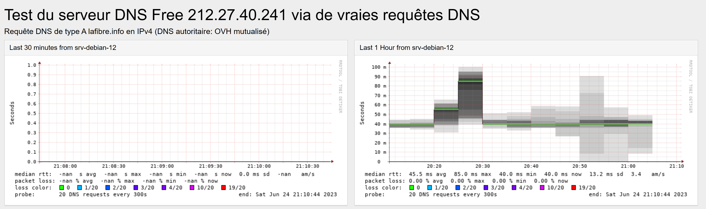

    
  
  
  
    

  <h2>Laboratoire numérique pour la cybersécurité, Linux & IT.</h2>

  

    
    
    
    
    
    
  

  

  

    <strong>Cybersécurité</strong>  • <strong>Linux Debian</strong>  • <strong>Sécurité informatique</strong> 
  

---

  
## À propos & Objectifs.

Ce projet propose des solutions innovantes et accessibles en cybersécurité, avec une approche centrée sur la simplicité d’utilisation et l’efficacité. Il vise à accompagner les utilisateurs dans la protection de leurs données et systèmes, tout en favorisant l’apprentissage et le partage des connaissances.

Le contenu est structuré, accessible et optimisé SEO pour répondre aux besoins de :
- 🎓 Étudiants : approfondir les connaissances
- 👨‍💻 Professionnels IT : outils et pratiques
- 🖥️ Administrateurs système : sécuriser l’infrastructure
- 🛡️ Experts cybersécurité : ressources techniques
- 🚀 Passionnés du numérique : explorer les bonnes pratiques

---

## 📡 SmokePing - Documentation & Fichiers de Configuration

---

### **Sommaire**

🟢 **Actif** – Dépôt totalement accessible  
🟠 **Partiel** – Dépôt partiellement accessible  
🔴 **Inactif** – Dépôt inaccessible ou indisponible

---

| N°  | Titre / Fichier | Description          | Lien                                                                                                                                                      |
|-----|-----------------|----------------------|-----------------------------------------------------------------------------------------------------------------------------------------------------------|
| 01  | Tuto            | Guide d'installation |  |

Fichiers de configuration : (`/etc/smokeping/config.d/`)

| N°  | Fichier          | Description                       | Lien                                                                                                                        |
|-----|------------------|-----------------------------------|-----------------------------------------------------------------------------------------------------------------------------|
| 01  | **Probes**       | Définition des sondes utilisées   |        |
| 02  | **Presentation** | Options d’affichage des résultats |  |
| 03  | **General**      | Paramètres généraux de SmokePing  |       |
| 04  | **Targets**      | Cibles à surveiller (IP, hôtes…)  |       |

---

<table>
<tr>
<td align="center"><b>🖥️ Infrastructure &amp; Sécurité</b></td>
<td align="center"><b>💻 Développement &amp; Web</b></td>
<td align="center"><b>🤖 Intelligence Artificielle</b></td>
</tr>
<tr>
<td align="center">
  
  
  
   
  
  
  
</td>
<td align="center">
  
  
  
   
  
  
  
</td>
<td align="center">
  
  
  
    
  
  &nbsp;
  
</td>
</tr>
</table>

 

<b>🔒 Un projet proposé par <a href="https://github.com/0xCyberLiTech">0xCyberLiTech</a> • Développé en collaboration avec <a href="https://claude.ai">Claude AI</a> (Anthropic) 🔒</b>

