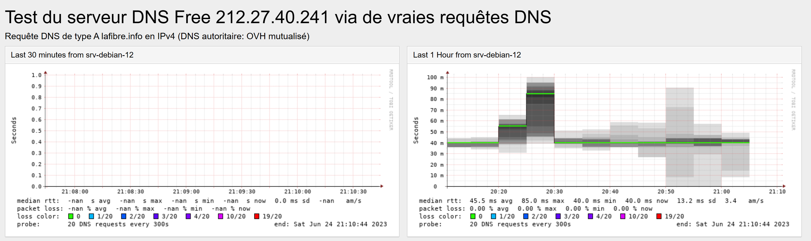

<div align="center">

  <br></br>
  
  <a href="https://github.com/0xCyberLiTech">
    
  </a>
  
  <br></br>
  
  <p align="center">
    <em>Tutos et configurations smokeping.</em><br>
    <b>📊 Monitoring – 📈 Performance – ⚙️ Fiabilité</b>
  </p>


  <a href="https://0xcyberlitech.github.io/">
    
  </a>
  <a href="https://github.com/0xCyberLiTech">
    
  </a>
  <a href="https://github.com/0xCyberLiTech/Smokeping/releases/latest">
    
  </a>
  <a href="https://github.com/0xCyberLiTech/Smokeping/blob/main/CHANGELOG.md">
    
  </a>
  <a href="https://github.com/0xCyberLiTech?tab=repositories">
    
  </a>
  <a href="https://github.com/0xCyberLiTech/Smokeping/graphs/contributors">
    
  </a>

</div>

---

### 👨‍💻 **À propos de moi.**

> Bienvenue dans mon **laboratoire numérique personnel** dédié à l’apprentissage et à la vulgarisation de la cybersécurité.  
> Passionné par **Linux**, la **cryptographie** et les **systèmes sécurisés**, je partage ici mes notes, expérimentations et fiches pratiques.  
> Pproposer un contenu clair, structuré et accessible pour étudiants, curieux et professionnels de l’IT.  

<p align="center">
  <a href="https://github.com/0xCyberLiTech" target="_blank" rel="noopener">
    
  </a>
</p>

---

### 🎯 Objectif du dépôt

> Ce dépôt vise à centraliser les connaissances pratiques liées à la **supervision des systèmes d'information**. Il s’adresse à tous ceux souhaitant :
> 
> - Comprendre les enjeux du monitoring
> - Déployer des outils efficaces (Zabbix, Nagios, etc.)
> - Améliorer la **stabilité**, la **performance** et la **disponibilité** de leur infrastructure IT

---



## SMOKEPING Installation & Configuration.

Les problèmes réseaux et de qualités sont souvent difficiles à comprendre et à analyser, encore faut il les trouver. 

Smokeping peut vous y aider. SmokePing est un logiciel qui vous permet de conserver un historique de la latence de votre réseau.

Il est conçu par Tobi Oetiker, le créateur de MRTG et RRDtool.

SmokePing est prévu pour calculer le RTT (Real Trip Time) entre les différents composants de votre réseau et peut le faire aussi bien avec un basique ping ICMP qu’avec des pings plus spécifiquement adaptés aux protocoles HTTP, SMTP, LDAP, DNS…

Note : Nous partons du principe qu'Apache2 est installé et fonctionnel avant d'installer smokeping.

- Avant de commencer il faut installer et configurer (NTPsec).

[Installer et configurer (NTPsec)](https://github.com/0xCyberLiTech/NTPsec/blob/main/Installer-et-configurer-NTPsec.md)

## Nous pouvons passer à l'nstallation et configuration.

Mettre à jour l'index des packages.
```
apt update && apt upgrade -y
```
Installez le package smokeping, mais ignorez les packages recommandés.
```
apt install --no-install-recommends smokeping dnsutils curl
```
Dans un premier temps, vérifiez les paramètres de la base de données, car vous ne pourrez pas les modifier facilement par la suite.

J'utiliserai les paramètres par défaut, ce qui signifie 20 pings toutes les 5 minutes.

Nous retrouverons nos fichiers de configuration vers :

```
/etc/smokeping/config.d/
```
```
── config.d
   ├── Alerts
   ├── Database
   ├── General
   ├── pathnames
   ├── Presentation
   ├── Probes
   ├── Slaves
   └── Targets

```
Les fichiers de configuration pris en charge sont déclarés dans le fichier (/etc/smokeping/config).
```
cat /etc/smokeping/config.d/
```
```
@include /etc/smokeping/config.d/General
@include /etc/smokeping/config.d/Alerts
@include /etc/smokeping/config.d/Database
@include /etc/smokeping/config.d/Presentation
@include /etc/smokeping/config.d/Probes
@include /etc/smokeping/config.d/Slaves
@include /etc/smokeping/config.d/Targets
```
- Fichier de configuration (/etc/smokeping/config.d/General).
```
cat /etc/smokeping/config.d/General
```
```
# --------------------------------------------------------------------------
# 0xCyberLiTech
# Date de création : le 23-06-2023
# Date de modification : le 24-06-2023
# Sujet : SMOKEPING - /etc/smokeping/config.d/General
# --------------------------------------------------------------------------
*** General ***

owner    = CyberLiTech
contact  = some@address.nowhere
mailhost = my.mail.host
# NOTE: do not put the Image Cache below cgi-bin
# since all files under cgi-bin will be executed ... this is not
# good for images.
cgiurl = http://some.url/smokeping.cgi
# specify this to get syslog logging
syslogfacility = local0
# each probe is now run in its own process
# disable this to revert to the old behaviour
# concurrentprobes = no

@include /etc/smokeping/config.d/pathnames
```
Mettez à jour l'adresse cgiurl.

(cgiurl = http://some.url/smokeping.cgi) par (cgiurl = http://192.168.0.200/smokeping.cgi).

- Fichier de configuration, (/etc/smokeping/config.d/Alerts).
```
cat /etc/smokeping/config.d/Alerts
```
```
# --------------------------------------------------------------------------
# 0xCyberLiTech
# Date de création : le 23-06-2023
# Date de modification : le 24-06-2023
# Sujet : SMOKEPING - /etc/smokeping/config.d/Alerts
# --------------------------------------------------------------------------
*** Alerts ***
to = alertee@address.somewhere
from = smokealert@company.xy

+someloss
type = loss
# in percent
pattern = >0%,*12*,>0%,*12*,>0%
comment = loss 3 times  in a row
```
- Fichier de configuration, (/etc/smokeping/config.d/Database).
```
cat /etc/smokeping/config.d/Database
```
```
# --------------------------------------------------------------------------
# 0xCyberLiTech
# Date de création : le 23-06-2023
# Date de modification : le 24-06-2023
# Sujet : SMOKEPING - /etc/smokeping/config.d/Database
# --------------------------------------------------------------------------
*** Database ***

step     = 300
pings    = 20

# consfn mrhb steps total

AVERAGE  0.5   1  1008
AVERAGE  0.5  12  4320
    MIN  0.5  12  4320
    MAX  0.5  12  4320
AVERAGE  0.5 144   720
    MAX  0.5 144   720
    MIN  0.5 144   720
```
- Fichier de configuration (/etc/smokeping/config.d/Presentation).
```
cat /etc/smokeping/config.d/Presentation
```
```
# --------------------------------------------------------------------------
# 0xCyberLiTech
# Date de création : le 23-06-2023
# Date de modification : le 26-06-2023
# Sujet : SMOKEPING - /etc/smokeping/config.d/Presentation
# --------------------------------------------------------------------------
*** Presentation ***

template = /etc/smokeping/basepage.html
charset = utf-8
htmltitle = yes
graphborders = no

+ charts

menu = Charts
title = The most interesting destinations

++ stddev
sorter = StdDev(entries=>4)
title = Top Standard Deviation
menu = Std Deviation
format = Standard Deviation %f

++ max
sorter = Max(entries=>5)
title = Top Max Roundtrip Time
menu = by Max
format = Max Roundtrip Time %f seconds

++ loss
sorter = Loss(entries=>5)
title = Top Packet Loss
menu = Loss
format = Packets Lost %f

++ median
sorter = Median(entries=>5)
title = Top Median Roundtrip Time
menu = by Median
format = Median RTT %f seconds

+ overview

width = 600
height = 50
range = 10h

+ detail

width = 600
height = 200
unison_tolerance = 2

"Last 30 minutes" 30m
"Last 1 Hour"     1h
"Last 3 Hours"    3h
"Last 24 Hours"   24h
"Last 48 Hours"   48h
"Last 10 Days"    10d
"Last 30 Days"    30d
"Last 90 Days"    90d
"Last 360 Days"   360d

#+ hierarchies
#++ owner
#title = Host Owner
#++ location
#title = Location
```
Nous pouvons constater que nous avons rajouté deux variables de temps supplémentaires.
```
"Last 30 minutes" 3m
"Last 1 Hour"     1h
```

- Fichier de configuration, (/etc/smokeping/config.d/Probes).
```
cat /etc/smokeping/config.d/Probes
```
```
# --------------------------------------------------------------------------
# 0xCyberLiTech
# Date de création : le 23-06-2023
# Date de modification : le 26-06-2023
# Sujet : SMOKEPING - /etc/smokeping/config.d/Probes
# --------------------------------------------------------------------------
*** Probes ***
# --------------------------------------------------------------------------
# + FPing
# --------------------------------------------------------------------------
+ FPing
binary = /usr/bin/fping

++ FPingNormal
offset = 0%

++ FPingLarge
packetsize = 5000
offset = 50%

# --------------------------------------------------------------------------
# + FPing6
# --------------------------------------------------------------------------
#+ FPing6
#binary = /usr/bin/fping6
#offset = 40%

# --------------------------------------------------------------------------
# + DNS
# --------------------------------------------------------------------------
+ DNS
binary = /usr/bin/dig
forks = 1
offset = 70%

# --------------------------------------------------------------------------
# + Curl
# --------------------------------------------------------------------------
+ Curl
# probe-specific variables
binary = /usr/bin/curl
step = 60

# a default for this target-specific variable
urlformat = http://%host/
```
- Fichier de configuration, (/etc/smokeping/config.d/Targets).
```
cat /etc/smokeping/config.d/Targets
```
```
# --------------------------------------------------------------------------
# 0xCyberLiTech
# Date de création : le 21-06-2023
# Date de modification : le 23-06-2023
# Sujet : SMOKEPING - /etc/smokeping/config.d/Targets
# --------------------------------------------------------------------------
*** Targets ***

probe = FPingNormal
menu = Top
title = Network Latency Grapher
remark = Welcome to this SmokePing website.

# --------------------------------------------------------------------------
# ICMP Latency
# --------------------------------------------------------------------------
# (srv-linux-01)
# --------------------------------------------------------------------------

+ ICMP-latency-srv-linux-01
menu = ICMP latency (srv-linux-01)
title = ICMP latency for (srv-linux-01)

++ normal
title = Normal packetsize (56 bytes)
# remark =
probe = FPingNormal
menu = Normal packetsize (56 bytes)
host = 192.168.50.200

++ large
title = Large packetsize (5000 bytes)
# remark =
probe = FPingLarge
menu = Large packetsize (5000 bytes)
host = 192.168.50.200

# --------------------------------------------------------------------------
# ICMP Latency
# --------------------------------------------------------------------------
# (srv-linux-02)
# --------------------------------------------------------------------------
+ ICMP-latency-srv-linux-02
menu = ICMP latency (srv-linux-02)
title = ICMP latency for (srv-linux-02)

++ normal
title = Normal packetsize (56 bytes)
# remark =
probe = FPingNormal
menu = Normal packetsize (56 bytes)
host = 192.168.50.200

++ large
title = Large packetsize (5000 bytes)
# remark =
probe = FPingLarge
menu = Large packetsize (5000 bytes)
host = 192.168.50.200

# --------------------------------------------------------------------------
# ICMP Latency
# --------------------------------------------------------------------------
# (Freebox Delta)
# --------------------------------------------------------------------------
+ ICMP-latency-Freebox-Delta
menu = ICMP latency (Freebox Delta)
title = ICMP latency (Freebox Delta)

++ normal
title = Normal packetsize (56 bytes)
# remark =
probe = FPingNormal
menu = Normal packetsize (56 bytes)
host = 192.168.1.254

++ large
title = Large packetsize (5000 bytes)
# remark =
probe = FPingLarge
menu = Large packetsize (5000 bytes)

host = 192.168.1.254

# --------------------------------------------------------------------------
# ICMP Latency
# --------------------------------------------------------------------------
# (GT-AXE16000)
# --------------------------------------------------------------------------
+ ICMP-latency-GT-AXE16000
menu = ICMP latency (GT-AXE16000)
title = ICMP latency (GT-AXE16000)

++ normal
title = Normal packetsize (56 bytes)
# remark =
probe = FPingNormal
menu = Normal packetsize (56 bytes)
host = 192.168.50.1

++ large
title = Large packetsize (5000 bytes)
# remark =
probe = FPingLarge
menu = Large packetsize (5000 bytes)
host = 192.168.50.1

# --------------------------------------------------------------------------
# DNS Free
# --------------------------------------------------------------------------
# DNSFREE1 ---> 212.27.40.240 ---> dns1.proxad.net.
# DNSFREE2 ---> 212.27.40.241 ---> dns2.proxad.net.
# --------------------------------------------------------------------------
+ DNS-Free
menu = Etat des DNS Free
title = Etat des DNS Free primaire / secondaire

++ DNSFREE1
probe = DNS
menu = DNS Primaire IPv4 Free
title = Test du serveur DNS Free 212.27.40.240 via de vraies requêtes DNS
remark = Requête DNS de type A lafibre.info en IPv4 (DNS autoritaire: OVH mutualisé)
host = 212.27.40.240
lookup = lafibre.info

++ DNSFREE2
probe = DNS
menu = DNS Secondaire IPv4 Free
title = Test du serveur DNS Free 212.27.40.241 via de vraies requêtes DNS
remark = Requête DNS de type A lafibre.info en IPv4 (DNS autoritaire: OVH mutualisé)
host = 212.27.40.241
lookup = lafibre.info

# --------------------------------------------------------------------------
# DNS Orange
# --------------------------------------------------------------------------
# DNSORANGE1 ---> 80.10.246.2   ---> dns-abo-static-a.wanadoo.fr.
# DNSORANGE2 ---> 80.10.246.129 ---> dns-abo-static-b.wanadoo.fr.
# --------------------------------------------------------------------------
+ DNS-Orange
menu = Etat des DNS Orange
title = Etat des DNS Orange primaire / secondaire

++ DNSORANGE1
probe = DNS
menu = DNS Primaire IPv4 Orange
title = Test du serveur DNS Orange 80.10.246.2 via de vraies requêtes DNS
remark = Requête DNS de type A lafibre.info en IPv4 (DNS autoritaire: OVH mutualisé)
host = 80.10.246.2
lookup = lafibre.info

++ DNSORANGE2
probe = DNS
menu = DNS Secondaire IPv4 Orange
title = Test du serveur DNS Orange 80.10.246.129 via de vraies requêtes DNS
remark = Requête DNS de type A lafibre.info en IPv4 (DNS autoritaire: OVH mutualisé)
host = 80.10.246.129
lookup = lafibre.info

# --------------------------------------------------------------------------
# DNS SFR
# --------------------------------------------------------------------------
# DNSSFR1 ---> 109.0.66.10 ---> vip-dns-gp-primary.dns.sfr.net.
# DNSSFR2 ---> 109.0.66.20 ---> vip-dns-gp-secondary.dns.sfr.net.
# --------------------------------------------------------------------------
+ DNS-SFR
menu = Etat des DNS SFR
title = Etat des DNS SFR primaire / secondaire

++ DNSSFR1
probe = DNS
menu = DNS Primaire IPv4 SFR
title = Test du serveur DNS SFR 109.0.66.10 via de vraies requêtes DNS
remark = Requête DNS de type A lafibre.info en IPv4 (DNS autoritaire: OVH mutualisé)
host = 109.0.66.10
lookup = lafibre.info

++ DNSSFR2
probe = DNS
menu = DNS Secondaire IPv4 SFR
title = Test du serveur DNS SFR 109.0.66.20 via de vraies requêtes DNS
remark = Requête DNS de type A lafibre.info en IPv4 (DNS autoritaire: OVH mutualisé)
host = 109.0.66.20
lookup = lafibre.info

# --------------------------------------------------------------------------
# DNS Bouygues TELECOM
# --------------------------------------------------------------------------
# DNSSFR1 ---> 194.158.122.10 ---> nsabo1.bouyguesbox.fr.
# DNSSFR2 ---> 194.158.122.15 ---> nsabo2.bouyguesbox.fr.
# --------------------------------------------------------------------------
+ DNS-BOUYGUES-Telecom
menu = Etat des DNS Bouygues Telecom
title = Etat des DNS Bouygues Telecom primaire / secondaire

++ DNSBOUYGUES1
probe = DNS
menu = DNS Primaire IPv4 Bouygues Telecom
title = Test du serveur DNS Bouygues Telecom 194.158.122.10 via de vraies requêtes DNS
remark = Requête DNS de type A lafibre.info en IPv4 (DNS autoritaire: OVH mutualisé)
host = 194.158.122.10
lookup = lafibre.info

++ DNSBOUYGUES2
probe = DNS
menu = DNS Secondaire IPv4 Bouygues Telecom
title = Test du serveur DNS Bouygues Telecom 194.158.122.15 via de vraies requêtes DNS
remark = Requête DNS de type A lafibre.info en IPv4 (DNS autoritaire: OVH mutualisé)
host = 194.158.122.15
lookup = lafibre.info

# --------------------------------------------------------------------------
# DNS GOOGLE
# --------------------------------------------------------------------------
# DNSGOOGLE1 ---> 8.8.8.8 ---> dns.google.
# DNSGOOGLE2 ---> 8.8.4.4 ---> dns.google.
# --------------------------------------------------------------------------

+ DNS-Google
menu = Etat des DNS Google
title = Etat des DNS Google primaire / secondaire

++ DNSGOOGLE1
probe = DNS
menu = DNS Primaire IPv4 Google
title = Test du serveur DNS Google 8.8.8.8 via de vraies requêtes DNS
remark = Requête DNS de type A lafibre.info en IPv4 (DNS autoritaire: OVH mutualisé)
host = 8.8.8.8
lookup = lafibre.info

++ DNSGOOGLE2
probe = DNS
menu = DNS Secondaire IPv4 Google
title = Test du serveur DNS Google 8.8.4.4 via de vraies requêtes DNS
remark = Requête DNS de type A lafibre.info en IPv4 (DNS autoritaire: OVH mutualisé)
host = 8.8.4.4
lookup = lafibre.info

# --------------------------------------------------------------------------
# HTTP latency
# --------------------------------------------------------------------------
# Myhost1 ---> HTTP ---> zimbra.free.fr
# Myhost2 ---> HTTP ---> web-mail.laposte.ne
# --------------------------------------------------------------------------
+ HTTP
menu = HTTP latency
title = HTTP latency

++ myhost1
menu = zimbra.free.fr
title = HTTP latency for myhost1
remark = HTTP / zimbra.free.fr
host = zimbra.free.fr

++ myhost2
menu = web-mail.laposte.net
title = HTTP latency for myhost2
remark = HTTP / web-mail.laposte.net
host = web-mail.laposte.net
```
Accéder à la console Smokeping :

(http://mon-ip/smokeping/smokeping.cgi) ou (http://FQDN/smokeping/smokeping.cgi)
